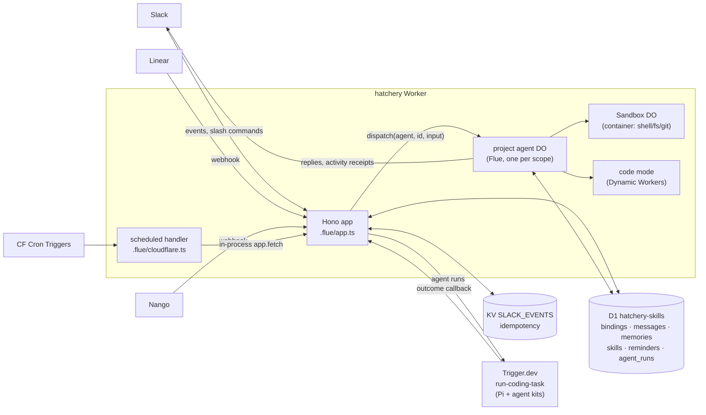
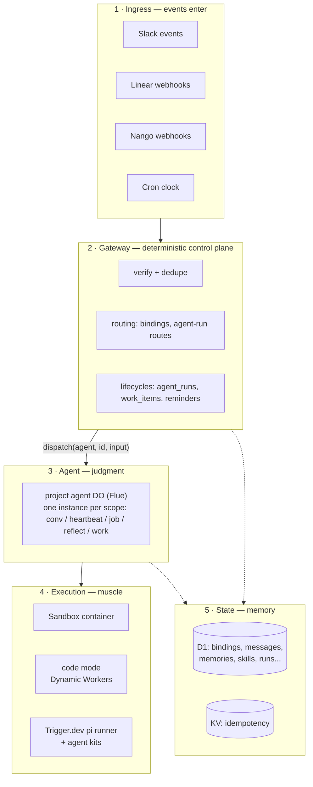
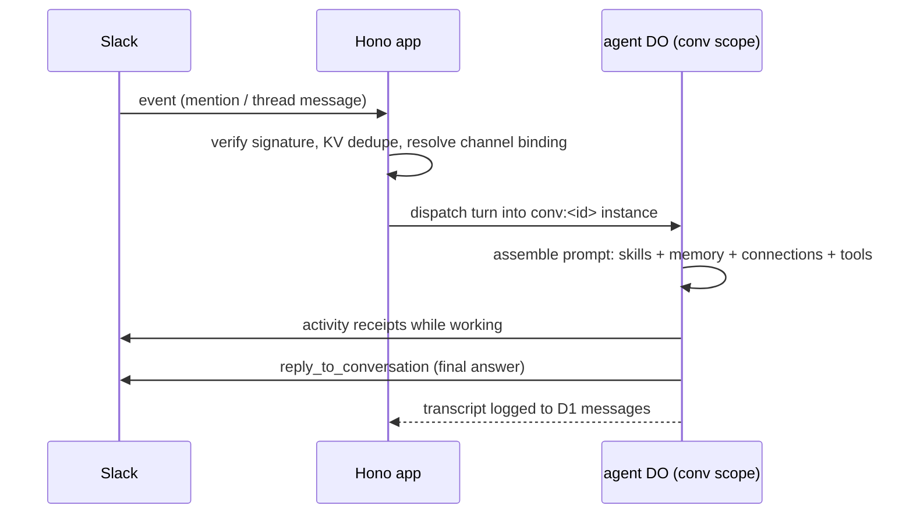

# Hatchery

A channel-scoped AI teammate on Cloudflare Workers. Slack is the front door; each bound channel
gets its own agent running in a Durable Object (via [Flue](https://flueframework.com)); Linear
state transitions can dispatch an external Trigger.dev-hosted Pi runner; provider connections
(GitHub, Linear, Notion) are brokered through Nango.

Since the Flue 0.11 upgrade it deploys as **one Cloudflare Worker plus one Trigger.dev runner**
(the old `hatchery-ticker` cron worker is gone — the clock moved in-house):

```
hatchery          Slack/Linear/Nango ingress + cron clock + agent DOs + sandbox container
run-coding-task   a Trigger.dev task that runs Pi + Agent Kits and calls Hatchery back
```

## Architecture



One agent instance = one conversation (Flue 0.11 thread-as-instance). Instance ids are
`project:<projectId>:agent:<slug>/<scope>` where the scope picks the lane:
`conv:<conversationId>` (Slack threads), `heartbeat`, `job:<jobId>` (reminders),
`reflect:<ts>` (nightly REM), `work:<itemId>` (workbench).

### The layers

Conceptually the system is five layers, and the model's judgment is deliberately
sandwiched between two deterministic ones: the gateway above it filters what is worth a
model call, the execution layer below it does only what it is told and leaves an audit
row. Token spend and blast radius are both pinched at the agent layer.



1. **Ingress** — things happen: Slack messages, Linear transitions, OAuth callbacks, and
   time itself (the crons are just another event source). No intelligence, just signals.
2. **Gateway** — decisions in code: signature checks, KV dedupe, project resolution, and
   the bookkeeping state machines. Deterministic, cheap, testable — no tokens spent.
3. **Agent** — decisions by model. The only layer with judgment; the instance id's scope
   decides which lane of the agent wakes up.
4. **Execution** — muscle in three sizes: the sandbox container (shell/fs/git), Dynamic
   Workers (code snippets), and the Trigger.dev pi runner (repo-scale coding). All lazy,
   all audited, none of them think for themselves.
5. **State** — what survives: D1 is the durable truth, KV the short-lived dedupe.
   Everything above can die and restart; this layer is why that's fine.

### Life of a Slack turn



### The cron clock

Flue 0.11 forwards `scheduled()`, so the Worker hosts its own crons
(`wrangler.jsonc` `triggers.crons`, mirrored as constants in `.flue/cloudflare.ts`).
Each fire calls a token-guarded internal route in-process via `app.fetch` — same routes and
guards the external ticker used to hit, minus the second worker. Crons are UTC, no DST shift.

| Cron | Route | Purpose |
|---|---|---|
| `0 */6 * * *` | `/__heartbeat` | liveness backstop, fans out to active projects |
| `0 19 * * *` | `/__internal/reflect-sweep` | nightly REM at 03:00 KL — consolidate transcripts into memory |
| `*/2 * * * *` | `/__internal/agent-runs/reconcile` | agent-run outbox backstop |
| `* * * * *` | `/__internal/scheduled` (per due job) | agent-set reminders, stored in D1, claimed via CAS |

## Module map

| Module | What it does |
|---|---|
| `.flue/app.ts` | Worker entry: all HTTP ingress (Slack events/commands, Linear + Nango webhooks, `__internal`/`__admin` routes) |
| `.flue/cloudflare.ts` | Cron clock (`scheduled` handler) + `Sandbox` class export |
| `.flue/agents/project.ts` | The agent definition: assembles skills, memory, connections, and tools per instance |
| `src/agent` | System-prompt assembly and the agent's self-status tool |
| `src/project` | Channel→project bindings, conversation reply targets, model resolution (D1: `bindings`, `conversation_targets`) |
| `src/slack` | Slack event handling, activity receipts, blocks, slash commands, file auth |
| `src/gateway` | Ingress utilities: token auth, cron parser (KL-aware), reminders store (D1: `reminders`) |
| `src/knowledge` | Memory + reflection: durable project facts and the nightly REM consolidation (D1: `memories`, `messages`) |
| `src/skills` | Agent-authored skills as SKILL.md docs with an active/archived lifecycle (D1: `skills`) |
| `src/connections` | Provider connection broker over Nango: OAuth/PAT/App modes, per-provider tools (D1: `connections`) |
| `src/providers` | The provider integrations themselves: GitHub read tools, generic API tool, Nango client |
| `src/agent-runs` | Control plane for external coding runs: lifecycle, routes, dispatch, reconcile (D1: `agent_runs`) |
| `src/workbench` | Internal work-item runner; dispatches to flue/Trigger.dev/webhook targets (D1: `work_items`, `work_runs`) |
| `src/workspace` | Sandbox container tools: exec, file I/O, Slack file loading |
| `src/code-mode` | Small JS/Python snippets in isolated Dynamic Workers, with an audit ledger |
| `src/setup` | Setup-status tool: what's connected, what's missing |
| `src/config`, `src/shared` | Deployment config (team allowlist) and cross-cutting utils (redaction, byte bounds, KV idempotency) |
| `trigger/` | The Trigger.dev `run-coding-task`: spawns Pi, manages branch/PR, parses the RPC stream |
| `agent-kits/` | Markdown agent definitions + skills for the Pi runner (`coding-default` live; `delivery` — the gated plan→implement→review pipeline — wired end-to-end but not yet activated on any route) |

Bindings: D1 `hatchery-skills` (`DB`), KV `SLACK_EVENTS`, DO `SANDBOX` (container), and a
Dynamic Worker loader. Flue generates the agent DO bindings (`FLUE_PROJECT_AGENT`,
`FLUE_REGISTRY`) itself.

Deeper docs: [docs/deployment.md](docs/deployment.md) (setup, secrets, dashboard wiring),
[docs/runner-contract.md](docs/runner-contract.md) (Hatchery ⇄ runner protocol),
[docs/decisions/](docs/decisions/) (ADRs), [docs/planning/](docs/planning/) (design notes,
including the [Flue 0.11 upgrade](docs/planning/flue-011-upgrade.md)).

---

## Day-to-day

```bash
npm run deploy     # gated: tsc --noEmit && npm test && flue build && wrangler deploy
npm test           # full suite (tsx)
npm run typecheck  # tsc --noEmit
```

After adding a migration, `wrangler d1 migrations apply hatchery-skills --remote` (also run by
`./scripts/setup.sh migrate`). The migration history is tracked in the `d1_migrations` table.

## Local dev

Put a throwaway `ZAI_API_KEY` (and any secrets you want to exercise) in `.dev.vars`, then
`npx flue dev --target cloudflare`. Note: model-call failures locally are often local-egress flakiness
— verify model-dependent changes against a deployed Worker, not `flue dev`.
