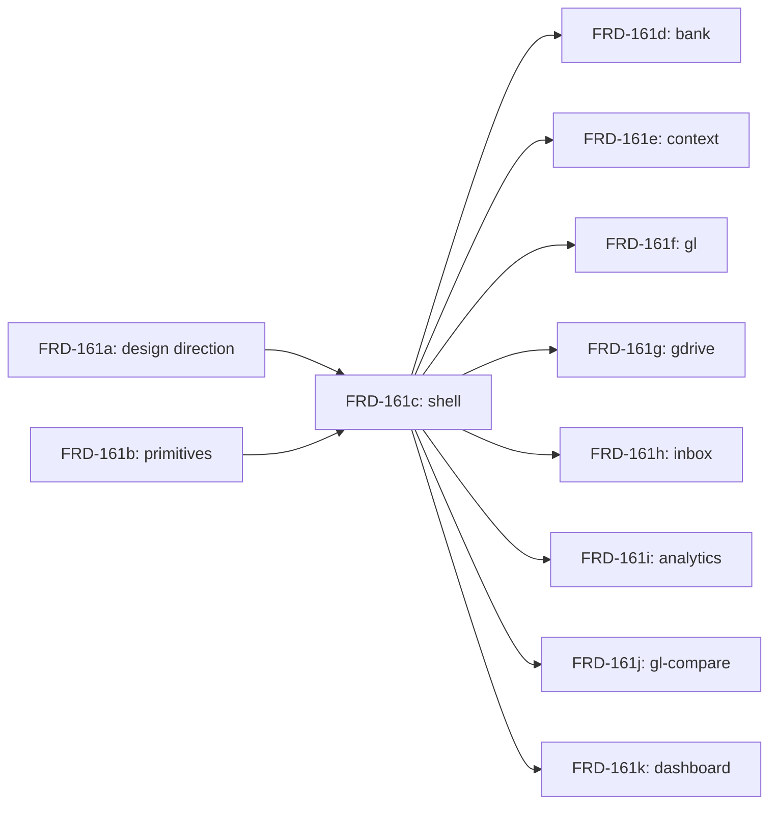

# Outcome
<one-line user-visible result of shipping the whole umbrella;
 e.g. "Gridfin shell + 8 page surfaces match the new design system">

# Cuts considered
<Two distinct decompositions the planner considered, with the
 picked one named and the alternative explicitly named. Forces the
 road-not-taken visible at review time so the reviewer can push back
 on rationalization. See decomposition-review-rubric Check 2.

 If the umbrella shape is so dominant that only one decomposition is
 honestly defensible (e.g., 8 independent sections each its own
 validation surface), still write the cut you rejected and one
 sentence on why it wasn't honest to propose.>

## Cut A — <one-line name, e.g. "Layered: DB → API → UI">
<one-paragraph sketch of the slice list under this cut.>

## Cut B — <one-line name, e.g. "Vertical with feature flag, then expand">
<one-paragraph sketch of the slice list under this cut.>

## Picked: Cut <A | B>
**Reason:** <one sentence naming the specific constraint that breaks
 the alternative — e.g. "Cut B requires shipping a flag system that
 doesn't exist; Cut A reuses existing migration + handler patterns.">
**Shippability:** <for each slice in the picked cut, state whether
 shipping it alone (and the others never shipping) leaves the product
 better, same, or worse than today. A slice that leaves the product
 worse is wrongly cut — the reviewer REJECTs on this.>

# Slices
<ordered list. one entry per child issue. order is dispatch order
 along the DAG below, not arbitrary.

 each slice has a stable `slice-id` field: the parent issue id with
 a single-letter suffix (e.g. FRD-161a, FRD-161b, ...). slice-ids are
 stable across replaning — once assigned, a slice-id does not change.
 the create-issues step uses slice-ids to detect already-created children
 on retry.>

## <slice-id> — <slice title>
slice-id: <stable id, e.g. FRD-161a>
**Scope:**       <one sentence: what this slice does, what it leaves out>
**Evidence:**    <file paths + line counts or specific patterns that bound this slice>
**Dependencies:** <other slice-ids that must complete first; or `none`>
**Alternative considered:** <one line on a meaningfully different way this slice's scope could have been cut, and why this scope won — e.g. "could have combined with the schema slice but the recompute removal needs its own validation pass" or "none — boundary forced by the migration sequence">

## <slice-id> — <slice title>
slice-id: <next stable id>
...

# DAG
<ASCII or Mermaid showing slice ordering and dependencies. example:>

```
<slice-a> ─┐
           ├─→ <slice-c> ─→ <slice-d, e, f, g, h, i, j, k> (parallel)
<slice-b> ─┘
```

<or>



# Surfaced concerns
<state lies, missing primitives, exclusions with rationale.
 things the operator needs to decide before slices dispatch.>

- **<concern title>** — <one-paragraph description; cite file:line or
  specific tracker state evidence; explain what changes if the operator
  decides differently.>

# Excluded from this decomposition
<files, routes, or sub-areas the umbrella might suggest but the
 decomposition deliberately omits, with rationale. example:
 "AR/AP/Activity/Tasks routes are stub-only at <file:line>; not
 included in the per-function migration list.">

- **<excluded surface>** — <rationale>

# Operator questions
<Only include questions that change execution. Nice-to-knows belong in
`notes:` of the decomposition-review verdict, not here.

Every question must be typed. Use exactly one of:
- `blocking` — must be answered in this artifact before reviewer approval
- `defaulted` — create-issues may proceed using the stated default
- `slice-local` — defer to the named child issue; create-issues copies it there

An APPROVED decomposition must have no unresolved `blocking` questions.>

## Q1 — <short question title>
type: blocking | defaulted | slice-local
status: unresolved | answered | default-applied | deferred-to-slice
applies-to: create-issues | <slice-id>[, <slice-id>...]
default: <required when type: defaulted; otherwise `none`>
answer: <required before approval when type: blocking; otherwise optional>
effect: <what changes in slices/dependencies/materialization based on the answer>
question: <yes/no or one-of-list question, not free-form essay>

## Q2 — <short question title>
...

# Child Issue Creation

After this breakdown is approved (review APPROVED + parent at
`Breakdown Proposed`), the operator either moves the parent issue to
`Breakdown Approved` or runs:

```
create-issues <parent-id>
```

The create-issues step is per-slice idempotent: it queries Linear for
existing children parented to <parent-id>, matches by slice-id (Slice:
<slice-id> in the child body, falling back to title prefix
`[<slice-id>]`), skips already-created slices, and creates the missing
ones. Partial failure (rate-limit, network) leaves the PR open with a
status comment; re-running resumes. If any `blocking` question is still
unanswered, create-issues creates no children and halts with the missing
question ids. `defaulted` questions proceed with their defaults; `slice-local`
questions are copied into the relevant child issue body. Full success moves
dependency-free children to `Run Agent`, leaves dependent children in
Todo/default with dependency context, and closes the PR with links to all
children. The full lifecycle lives in the conductor's § Create-issues phase.

Created child issues use:

- title: `[<slice-id>] <slice title>`
- body: <Scope from this template>, followed by:
  ```
  ---
  Parent: <parent-id>
  Slice: <slice-id>
  Source decomposition: <PR url> @ <commit sha>
  ```
- parent-link: <parent-id>
